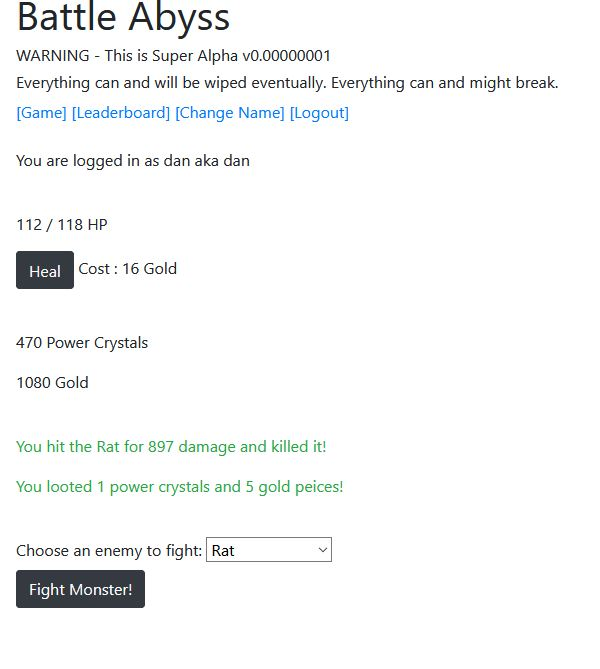

# blacksentryclone
Black Sentry was a multiplayer incremental game which I have decided to try to recreate.
  
Originally it was created with pretty much just javascript I think, also it was around 10-15 years ago so things are going to be done a little differently now.
  
What I have ended up making is a bare-ish bones incremental game. For specifics about features please see below.
  
## Features
- User registration and log in.
- Persistant progress saved to a database.
- Randomly generated Player names, mostly for leaderboard display.
- After creating a django superuser, very easy access to:
  - User management (Auth)
  - Player management (Gameplay Characters)
  - Enemy management
  
Its a little rough around the edges, but is in a currently working state and hosted at www.battleabyss.com.

